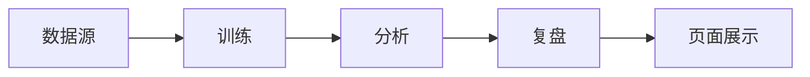
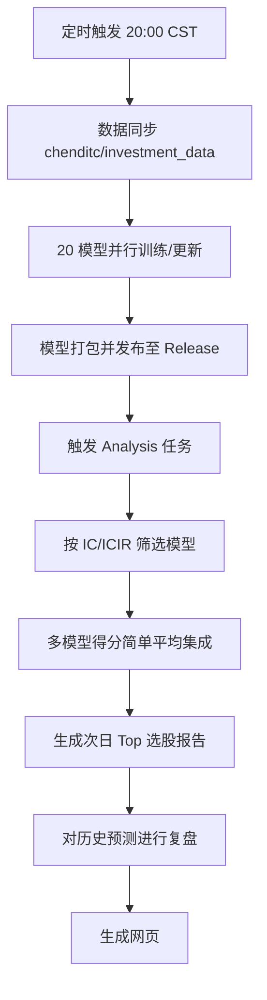

# QlibAssistant

[](https://github.com/touhoufan2024/qlibAssistant/actions/workflows/train.yml)
[](https://github.com/touhoufan2024/qlibAssistant/actions/workflows/analysis.yml)

**每晚自动跑模型，次日给你一份 CSI300 选股清单。准不准？有复盘数据可查。**

👉 [查看每日预测结果](https://touhoufan2024.github.io/qlibAssistant/) · 📊 [复盘统计：历史预测准确度](https://touhoufan2024.github.io/qlibAssistant/pages/mahoupao/review_result.html)  📈 [简单topk策略 净值曲线](https://touhoufan2024.github.io/qlibAssistant/pages/mahoupao/nav_curve.html)

> ⚠️ 量化预测仅供参考，不构成投资建议。股市有风险，入市需谨慎。

---

## 为什么值得一看？

- **全自动**：每晚 8 点左右自动拉数据、训练、选股，次日直接看结果
- **多模型集成**：25 个模型（5 种算法 × 5 种回溯周期）投票，降低单模型过拟合
- **可验证**：有复盘统计，历史预测的胜率、止盈表现一目了然
- **规则过滤**：按波动率、动量等规则筛掉高风险标的，输出更稳健的 `filter_ret` 表

---

## 分数是什么意思？

**预测分数（avg_score）**：基于当天收盘数据，预测「明天收盘买、后天收盘卖」的期望收益率。

- 分数越高，模型越看好
- `pos_ratio`：有多少个模型预测正收益，如 0.875 表示 8 个模型里 7 个看涨
- 想看更细的说明：📖 [帮助文档](https://touhoufan2024.github.io/qlibAssistant/pages/about)

---

## 预测准不准？

我们定期对历史预测做复盘，统计止盈胜率、持有一天收益等。  
👉 [复盘统计分析](https://touhoufan2024.github.io/qlibAssistant/pages/mahoupao/review_result.html)

**小贴士**：实盘不必死等收盘价买入。若当日已明显拉升，可挂个稍低的价格，等更合适的机会。

---

## 自动化流水线



- **数据**：自动从 [chenditc/investment_data](https://github.com/chenditc/investment_data) 拉取最新 A 股数据
- **训练**：XGBoost、LightGBM、DoubleEnsemble、Linear，滚动 1～5 年历史
- **筛选**：按 IC、ICIR、Rank IC 等指标筛出表现较好的模型, 并给出权重
- **预测**：多模型加权平均分数，生成 `xxx_ret`、`xxx_filter_ret` 汇总表

> 自动调度可能排队，实际执行可能延后。

---

## 快速上手

### 只看结果（推荐）

直接打开 [每日预测结果](https://touhoufan2024.github.io/qlibAssistant/)，按日期看最新表格。优先看 `xxx_filter_ret`，已做稳健性过滤。

### 本地跑一遍

```bash
pip install -r requirements.txt
cd ./roll && python ./roll.py data update
cd ./roll && python ./roll.py model decompress_mlruns   # 解压最新模型
cd ./roll && python ./roll.py model selection           # 生成预测
```

或解压 [GitHub Releases](https://github.com/touhoufan2024/qlibAssistant/releases) 中的模型包到 `~/qlibAssistant/mlruns`。

---

## 项目声明

本项目初衷为作者自用的量化脚本，目前正处于从「个人工具」向「开源项目」过渡的完善与规范阶段。

---

## 详细说明

以下内容面向希望本地复现或二次开发的用户。

### 自动化流水线架构（详细）



### 模型集成方案 (Ensemble Strategy)

- **基础算法**：XGBoost、LightGBM、DoubleEnsemble、Linear
- **训练窗口**：滚动回溯过去 1～5 年历史数据，共得到 20 个模型
- **模型筛选**：按 IC、ICIR、Rank IC、Rank ICIR 等指标筛选表现较好的模型
- **聚合方式**：对通过筛选的模型预测分（Score）取**简单平均**

### 功能模块

| 模块 | 说明 |
|------|------|
| 数据管理 (`data`) | 从 [chenditc/investment_data](https://github.com/chenditc/investment_data) 同步最新 A 股日线数据 |
| 模型训练 (`train`) | 支持断点续训，自动管理模型实验 |
| 模型预测 (`model`) | 筛选最优模型并执行推理，输出 `xxx_ret`、`xxx_filter_ret` 等汇总表 |

### 完整本地运行步骤

**第一步：准备环境与数据**

```bash
pip install -r requirements.txt
cd ./roll && python ./roll.py data update
```

**第二步：模型训练**

```bash
# 滚动训练 LightGBM 模型
cd ./roll && python ./roll.py --pfx_name="EXP" --model_name="LightGBM" --dataset_name="Alpha158" --stock_pool="csi300" --rolling_type="custom" train start_custom

# 使用 CI 同款方式训练 20 个模型（1～5 年周期）
cd ./roll && python ../script/run.py

# 或直接解压仓库自带的最新模型（每日更新）到 ~/.qlibAssistant/mlruns
cd ./roll && python roll.py model decompress_mlruns
```

**第三步：生成预测**

```bash
cd ./roll && python ./roll.py model selection
```

### 预测逻辑说明

- **目标 (Label)**：基于 T 日收盘数据，预测「T+1 日收盘买入、T+2 日收盘卖出」的期望收益率（理论值，未考虑 A 股 10% 涨跌停限制）
- **下载最新模型**：📦 [GitHub Releases](https://github.com/touhoufan2024/qlibAssistant/releases)

---


## 感谢
- [chenditc/investment_data](https://github.com/chenditc/investment_data) 提供qlib数据源
- [microsoft/qlib](https://github.com/microsoft/qlib.git) 提供免费的量化框架

---

## 贡献与反馈

如有更好的因子建议或模型优化方案，欢迎提交 Issue 或 Pull Request。

---

## 交流群

### Telegram


---

## Star History

[](https://www.star-history.com/?repos=touhoufan2024%2FqlibAssistant&type=timeline&legend=top-left)
